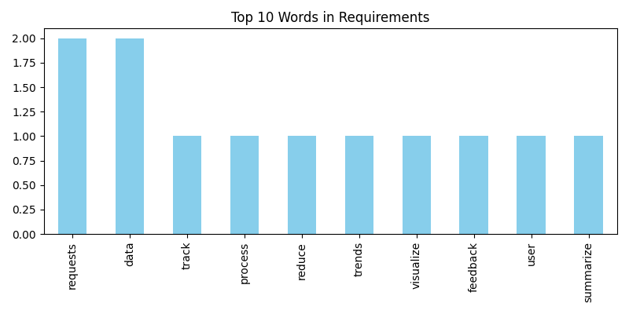

# BPAOT – Business Process Analysis & Optimization Tool

A full-stack workflow intelligence system to collect, analyze, and report on business process requirements. Built using Python, Streamlit, SQL, and automation libraries.

## Features

- 🔍 Requirement collection with CRUD support
- 📊 SQL-powered insights from a relational database
- 🧾 Auto-generated PDF reports with charts and tables
- 📤 CSV and Excel exports
- 📸 Instagram posting automation with dynamic captions
- 🕒 Weekly scheduling via cron + on-demand trigger from Streamlit

---

## Technologies Used

- **Python 3.13** (with `venv`)
- **Streamlit** – frontend UI
- **SQLite + Pandas** – database and analysis
- **Matplotlib** – visualizations
- **WeasyPrint** – PDF report generation
- **Instagrapi** – Instagram automation
- **Cron** – weekly scheduling
- **dotenv** – secure credentials

---

## Project Structure

BPAOT/
├── scripts/
│ ├── generate_report.py
│ ├── post_to_instagram.py
│ └── streamlit_requirement_tool.py
├── reports/
│ ├── bpaot_report.pdf
│ └── word_freq_chart.png
├── templates/
│ └── report_template.html
├── data/
│ └── bpaot.db
├── .env
├── .gitignore
└── README.md

---

## Setup Instructions

### 1. Clone the Repo

```bash
git clone https://github.com/your-username/BPAOT.git
cd BPAOT
```

### 2. Create and Activate Virtual Environment

python3 -m venv rohanb
source rohanb/bin/activate

### 3. Install Dependencies

pip install -r requirements.txt

### 4. Set Up .env File

IG_USERNAME=your_instagram_username
IG_PASSWORD=your_instagram_password

▶️ Running the App

### 1. Generate PDF Report

python scripts/generate_report.py

### 2. Start Streamlit Web App

streamlit run scripts/streamlit_requirement_tool.py

### 3. Post to Instagram (on-demand)

python scripts/post_to_instagram.py

### 4. Schedule Weekly Automation

Use crontab -e:
0 9 \* \* MON cd ~/BPAOT && source rohanb/bin/activate && python scripts/generate_report.py && python scripts/post_to_instagram.py

### Final Deliverables

| Module         | Output File(s)                            | Description                                      |
| -------------- | ----------------------------------------- | ------------------------------------------------ |
| Module 1       | `requirements.xlsx`                       | Raw business requirement entries                 |
| Module 2       | `bpaot.db`                                | SQLite database with structured data             |
|                | SQL charts in Streamlit                   | Word frequency, trend charts                     |
| Module 3       | `bpaot_report.pdf`, `word_freq_chart.png` | Auto-generated visual PDF reports                |
| Module 4       | `post_to_instagram.py`                    | Script that posts reports/images to Instagram    |
|                | Streamlit "📸 Post Now" button            | On-demand posting UI                             |
| Infrastructure | `.env`, `.gitignore`                      | Secure password storage and clean repo structure |

### 2. Example Output

1. Run your report:
   python scripts/generate_report.py
2. pen reports/word_freq_chart.png

3. Take a screenshot of the chart or save the image

4. In your README.md, change this placeholder:
   

## 3. Author

**Rohan Bheemavarapu**
[GitHub](https://github.com/nitinrohan)
[LinkedIn](www.linkedin.com/in/nitin-sampath-rohan-bheemavarapu-92292a247)
